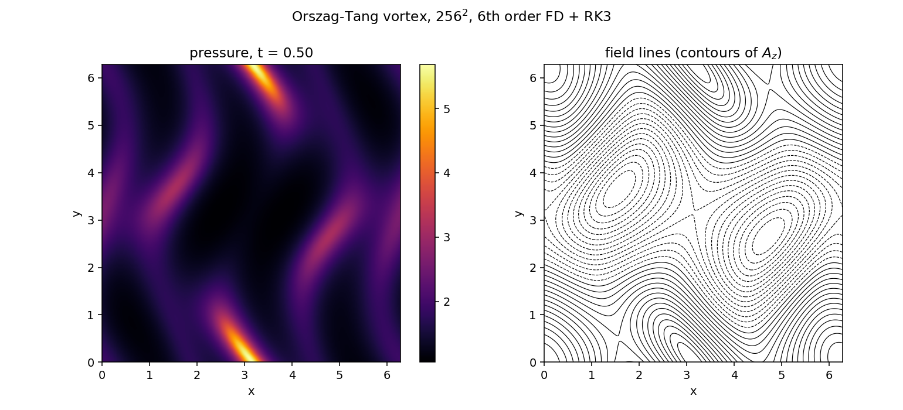

# gpu-mhd2d

A 2D compressible resistive MHD solver, written first in NumPy as a reference
and then ported to CUDA. This repository is the reference stage.

The point of the reference is not speed. It is to have a correct, readable
implementation whose output the GPU version can be diffed against field by
field, so that a disagreement in the port is unambiguously a bug in the port.

## Equations

Primitive variables, the set the Pencil Code and Astaroth evolve:

| symbol | meaning |
| --- | --- |
| `lnrho` | logarithmic density |
| `ux, uy` | velocity |
| `aa` | z-component of the magnetic vector potential |
| `ss` | specific entropy |

d(lnrho)/dt = -u.grad(lnrho) - div(u)

du/dt = -u.grad(u) - cs2 grad(lnrho + ss/cp) + (J x B)/rho + F_visc

d(aa)/dt = (u x B)_z + eta lap(aa)

rho T ds/dt = 2 rho nu S:S + eta J^2 + zeta (div u)^2

with mu0 = 1 and the ideal-gas entropy equation of state

cs2 = cs0^2 exp(gamma ss/cp + (gamma - 1)(lnrho - lnrho0))

**Why the vector potential.** The field is `B = curl(aa e_z)`, so `div(B) = 0`
is satisfied by construction rather than enforced afterwards. There is no
divergence cleaning anywhere in the code. The measured `max|div B|` below is
round-off and stays there.

## Numerics

- 6th-order centred finite differences, periodic in both directions
- 3rd-order 2N-storage Runge-Kutta (Williamson), two arrays of storage
- constant shear viscosity, magnetic diffusivity and entropy diffusion
- Nordlund-type shock viscosity, switched on only where the flow compresses

Centred differences with explicit diffusion, rather than a Riemann solver.
That is the choice the Pencil Code family makes, and it is the one that ports
cleanly to a GPU: every operation is a local stencil with no branching.

## Validation

All numbers below are produced by `python test_convergence.py` and
`python run_ot.py`.

**Operator order.** Error against analytic derivatives of `sin(x)cos(2y)`:

| N | error d/dx | order | error lap | order |
| --- | --- | --- | --- | --- |
| 32 | 4.06e-07 | - | 2.57e-05 | - |
| 64 | 6.38e-09 | 5.99 | 4.08e-07 | 5.97 |
| 128 | 9.99e-11 | 6.00 | 6.41e-09 | 5.99 |
| 256 | 1.57e-12 | 5.99 | 1.01e-10 | 5.98 |

**Solver order.** Sound wave, self-convergence against a 512-point reference,
time step held fixed across resolutions so the spatial error is what is being
measured:

| N | L2 error | order |
| --- | --- | --- |
| 32 | 5.75e-12 | - |
| 64 | 9.03e-14 | 5.99 |
| 128 | 1.41e-15 | 6.00 |

The comparison is against a numerical reference, not the linear analytic
solution: the code is nonlinear, and at these amplitudes the nonlinear
correction is larger than the truncation error being measured.

**Orszag-Tang vortex, 256^2, to t = 0.5:**

```
energy drift   6.80e-06
mass drift     3.80e-09
max |div B|    3.72e-13
```

Run on to t = 2.0, through shock formation, the energy drift grows to 1.2e-02
as the shock viscosity does its work, while `max|div B|` stays at 3.8e-13.
Kinetic and magnetic energy lost matches thermal energy gained to about 0.2
per cent, so the dissipated energy is going where it should.



## Running it

```
pip install numpy matplotlib

python test_convergence.py          # the three checks above
python run_ot.py --nx 256 --tmax 0.5
```

`run_ot.py` writes `ot_pressure.png`, `ot_diagnostics.csv` and `ot_state.npz`.
The `.npz` is the regression target for the CUDA port: a short run to
t = 0.5 is enough, and the two codes should agree to round-off for the first
few hundred steps.

## Performance baseline

NumPy, single core, float64: **1.04 microseconds per grid point per step** at
256^2. That is the number the GPU version has to beat, and it is in the README
so the comparison later is against something recorded rather than remembered.

## Where this is going

1. ~~NumPy reference, validated~~
2. CUDA port, global memory only, one kernel per RK stage. Target: results
   matching the reference to round-off. Not fast yet.
3. Shared-memory tiling for the stencils, fused RK stages, host transfers cut
   to the output cadence. Report achieved bandwidth against the card's peak,
   since a stencil code is bandwidth-bound and that ratio is what matters.
4. Timing table across grid sizes, CPU baseline against GPU.

The CUDA is written to stay hipify-clean, with no warp-level intrinsics, so
it ports to HIP and therefore to AMD hardware.

## What this does not do

Honest list, so nobody has to read the source to find out:

- 2D only, and `u_z = B_z = 0`. No out-of-plane components.
- Periodic boundaries only.
- Constant diffusivities plus shock viscosity. No hyperdiffusion yet, which
  is what a production run at high Reynolds number would want.
- Entropy diffusion is a plain Laplacian smoothing term, not a physical
  thermal conductivity.
- No Alfven wave convergence test, because a uniform background field has no
  periodic vector potential. Carrying the background separately from the
  evolved potential would fix this and is the obvious next test to add.
- No self-gravity, no rotation, no radiative transfer.
